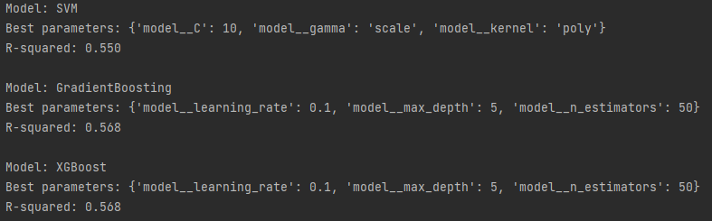

# aiap19-chung-kok-hui-351b
AIAP 19 Technical Assessment

### a. Particulars
    Name: Chung Kok Hui
    Email: khchung87@gmail.com

### b. Folder Structure Overview
    ├── .github
    ├── src
    │   └── index.py
    |   └── mlp.py
    ├── README.md
    ├── eda.ipynb
    ├── requirements.txt
    └── run.sh

### c. Instruction - Pipeline Execution and Parameters Modification

    - Run index.py will execute end-to-end machine learning pipeline. index.py produced two results; task_1_result returns the model to predict temperature and task_2_result returns the model to predict Plant Type-Stage.

    - The regression_model() and classifier_model() method take tuple as argument which is use in one of the steps in Pipeline method from sklearn.
    Hence to change the ML model or configure its hyperparameters, edit the elements in the tuple accordingly.

### d. ML Pipeline Workflow

    The Execution the ML pipeline consist of index.py and mlp.py.

    ***index.py***
    This script orchestrates the data cleaning, preprocessing, model training, and evaluation process. It utilizes the classes and methods defined in mlp.py.

    Logical Flow:

    1.  Import necessary classes:
        Imports CleanData and RunML classes from mlp.py and necessary machine learning
        tools from sklearn.

    2.  Data Cleaning:
        Creates an instance of the CleanData class.Calls the data_cleaning_pipeline() 
        method to perform a series of data cleaning and  processing steps (detailed in 
        the mlp.py section below).

    3.  Model Training and Evaluation:
        Creates an instance of the RunML class, passing the cleaned data.

        Defines two models:
        1.  gbr_model: A GradientBoostingRegressor for regression.
            Calls the regression_model() method with gbr_model to train and evaluate
            the regression model.

        2.  gbm_model: A GradientBoostingClassifier for classification.
            Calls the classifier_model() method with gbm_model to train and evaluate 
            the classification model.

    ***mlp.py***
    This script defines two main classes: CleanData and RunML, responsible for data cleaning and machine learning model training, respectively.

    Logical Flow:

    CleanData Class:

    - Consist a list of methods to clean and process data:
Table 1:
| Method Name | Description |
|---|---|
| load_data() | Loads data from an SQLite database into a pandas DataFrame |
| drop_humidity_sensor() | Removes the 'Humidity Sensor (%)' column |
| drop_duplicates() | Removes duplicate rows | 
| remove_units_nutrient_sensors() | Removes units from nutrient sensor columns and converts them to numeric |
| remove_negative_values() | Removes rows with negative values in specific columns |
| standardize_capitalization() | Standardizes capitalization in 'Plant Stage' and 'Plant Type' columns |
| impute_null_values() | Imputes missing values with mean or median |
| remove_outlier() | Removes outliers using the IQR method |
| data_transformation() | Combines nutrient columns, concatenates plant type and stage, and drops unnecessary columns |
| data_cleaning_pipeline() | Orchestrates the data cleaning process by calling the individual cleaning methods sequentially | 
    
    RunMLClass:

    - Takes in cleaned and processed data and run two ML models:
        - regression_model(): 

            -  preprocesses data using StandardScaler and OneHotEncoder.
            -  creates a pipeline with preprocessing and the provided 
               regression model.
            -  splits data into training and testing sets. 
            -  trains the model and makes predictions.     
            -  evaluates the model using Mean Squared Error and R-squared.

        - classifier_model(): 

            -  preprocesses data using StandardScaler.
            -  creates a pipeline with preprocessing and the provided classification
               model.
            -  splits data into training and testing sets. 
            -  trains the model and makes predictions.  
            -  evaluates the model using accuracy and classification report.

### e. Key Findings From EDA

    - The correlationship between the target variable Temperature and its feature variables are low. This suggest that a linear regression model will not do well. 

    - The nutrients N,P,K features are highly correlated with one another. A feature is created from the average of the 3 values of each row.

    - A bivarate Analysis on Plant Type-Stage against the average value of the sensors shows that a number of resources utilized on Plant Type Maturity and Vegetative are very similar. These resources are:

        1. Light Intensity
        2. CO2
        3. Nutrient P, N, K (Engineered Attributes)

    This suggest the model might not be able to differentiate or has a good predictive power on these two plant types.

### f. Description of The Features in The Dataset Processed 

    see Table 1.

### g. Choice of Machine Learning Model.
    Task 1a - Develop a Model to Predict Temperature

    The target variable of this task is temperature, which is a numerical data type. Thus, a regression model is selected to find the relationship between temperature and the rest of the feature variables. Also, a pairplot and correlation matrix conducted in EDA shows that there is no linear relationship between the target and features so a linear regression model is ruled out. 

    3 non-linear/ensemble models are experiemented to determine which model provides the best performance in predicting the target temperature. Hyperparameter tunning was conducted which used GridSearchCV to systematically search for the best combination of hyperparameters for each model. Each of the best model is then evaluated using R-squared (R2). The result of the search can be seen in the screenshot below, which shows that both GradientBoosting and XGBoost are tied with a R-squre value of 0.568.

    Task 1b - Develop a Model to Predict Plant Type-Stage Category

    The target variable of this task is Plant Type-Stage variable, which is the concatenation of Plant Type and Plant Stage attributes. As Plant Type-Stage is a categorical attribute with 12 distinct values, the machine learning problem here is a multi-classification type. 

    The choice of the ML model is likewise as Task 1a, experimenting 3 non-linear/ensemble models using GridSearchCV to systematically search for the best performing model to solve this task. 

### h. Evaluation of the models developed. 

    
