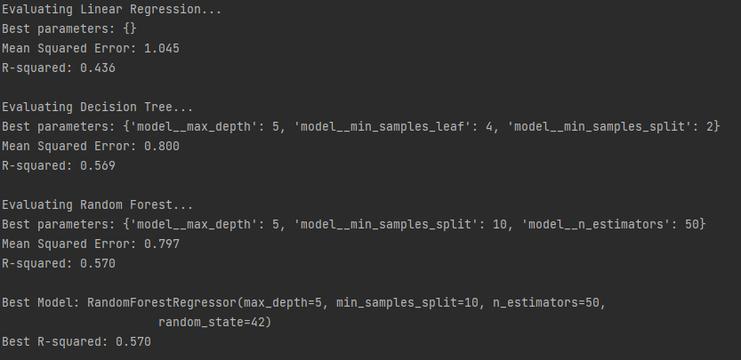
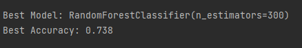

# aiap19-chung-kok-hui-351b
AIAP 19 Technical Assessment

### a. Particulars
    Name: Chung Kok Hui
    Email: khchung87@gmail.com

### b. Folder Structure Overview
    ├── .github
    ├── src
    │   └── index.py
    |   └── mlp.py
    ├── README.md
    ├── eda.ipynb
    ├── requirements.txt
    └── run.sh

### c. Instruction - Pipeline Execution and Parameters Modification

    - Run index.py will execute end-to-end machine learning pipeline.
      index.py produced two results; 
        1. task_2a_result returns the model to predict temperature.
        2. task_2b_result returns the model to predict Plant Type-Stage.

    - The regression_model() and classifier_model() method take tuple as argument which is use in one of the steps in Pipeline method from sklearn.
      Hence to change the ML model or configure its hyperparameters, edit the elements in the tuple accordingly.

### d. ML Pipeline Workflow

    The Execution the ML pipeline consist of index.py and mlp.py.

    index.py
    This script orchestrates the data cleaning, preprocessing, model training, and evaluation process. 
    It utilizes the classes and methods defined in mlp.py.

    Logical Flow:

    1.  Import necessary classes:
        Imports CleanData and RunML classes from mlp.py and necessary machine learning
        tools from sklearn.

    2.  Data Cleaning:
        Creates an instance of the CleanData class. Calls the data_cleaning_pipeline() 
        method to perform a series of data cleaning and  processing steps (detailed in 
        the mlp.py section below).

    3.  Model Training and Evaluation:
        Creates an instance of the RunML class, passing the cleaned data as argument.

        Defines two models:
        1.  rfr_model: A RandomForestRegressor for regression.
            Calls the regression_model() method with gbr_model to train and evaluate
            the regression model.

        2.  rfc_model: A RandomForestClassifier for classification.
            Calls the classifier_model() method with gbm_model to train and evaluate 
            the classification model.

    mlp.py
    This script defines two main classes;
     1. CleanData for data cleaning and processing.
     2. MLPipeline for training and evaluating machine learning model.

    Logical Flow:

    CleanData Class:

    - Consist a list of methods to clean and process data:
Table 1:

| Method Name | Description |
|---|---|
| load_data() | Loads data from an SQLite database into a pandas DataFrame |
| drop_humidity_sensor() | Removes the 'Humidity Sensor (%)' column |
| drop_duplicates() | Removes duplicate rows | 
| remove_units_nutrient_sensors() | Removes units from nutrient sensor columns and converts them to numeric |
| remove_negative_values() | Removes rows with negative values in specific columns |
| standardize_capitalization() | Standardizes capitalization in 'Plant Stage' and 'Plant Type' columns |
| impute_null_values() | Imputes missing values with mean or median |
| remove_outlier() | Removes outliers using the IQR method |
| data_transformation() | Combines nutrient columns, concatenates plant type and stage, and drops unnecessary columns |
| data_cleaning_pipeline() | Orchestrates the data cleaning process by calling the individual cleaning methods sequentially | 
    
    RunMLClass:

    - Takes in cleaned and processed data and run two ML models:
        - regression_model(): 

            -  preprocesses data using StandardScaler and OneHotEncoder.
            -  creates a pipeline with preprocessing and the provided 
               regression model.
            -  splits data into training and testing sets. 
            -  trains the model and makes predictions.     
            -  evaluates the model using Mean Squared Error and R-squared.

        - classification_model(): 

            -  preprocesses data using StandardScaler.
            -  creates a pipeline with preprocessing and the provided classification model.
            -  splits data into training and testing sets. 
            -  trains the model and makes predictions.  
            -  evaluates the model using accuracy and classification report.

### e. Key Findings From EDA

    - The correlationship between the target variable Temperature and its feature variables are low.

    - The nutrients N,P,K features are highly correlated with one another. 
      A feature is created from the average of the 3 values of each row.
      Nutrients N,P,K features will be excluded from the training the model.

    - Previous Cycle Plant Type and System Location Code have no predictive power against Temperature as there are no variability. 
      This suggest the model might not be able to differentiate or has a good predictive power on these two plant types.
      These two attributes will be excluded from the ML training to predict Temperature.

    - Plant stage seedling across plant types require lesser light, CO2, water, and nutrients than its maturity and vegatative stage.

    - Each plant type and its stage requires different degree of resources for growth

    - Resources are better utilized if the plants are grown on same location according to its type. 
      Also, make use of the sensors to control the resources allocation based on the plant stage will improve operational efficiency.

    
### f. Description of The Features in The Dataset Processed 

    see Table 1.

### g. Choice of Machine Learning Model.
    Task 2a - Develop a Model to Predict Temperature

    The target variable of this task is temperature, which is a numerical data type. 
    Thus, a regression model is selected to find the relationship between temperature and the rest of the feature variables. 
    The feature contains numerical and categorical variables. 
    3 regression models are selected with different alorithim approaches:

        1. Linear Regression with One-Hot Encoding:
           A baseline model approach to learn the linear relationship between features and target.

        2. Decision Tree:
           Tree-based model that can capture non-linear relationship between features and target.

        3. Random Forest:
           Ensemble method combines multiple regression trees to improve predictive performance. 
           

    These 3 models are experiemented to determine which model provides the best performance in predicting the target temperature. 
    Hyperparameter tunning was conducted which used GridSearchCV to systematically search for the best combination of hyperparameters for each model. 
    Each of the best model is then evaluated using R-squared (R2) and Mean Squared Error (MSE). 
    
    Random Forest is the best performing in terms of R2 and MSE.

    Task 2b - Develop a Model to Predict Plant Type-Stage Category

    The target variable of this task is Plant Type-Stage variable, which is the concatenation of Plant Type and Plant Stage attributes. 
    As Plant Type-Stage is a categorical attribute with 12 distinct values, the machine learning problem here is a multi-classification type. 

    The approach to get the best ML model is likewise as Task 2a, experimenting 3  models using GridSearchCV to systematically search 
    for the best performing model to solve this task. 
    
    3 regression models are selected with different alorithim approaches:

        1. Logistic Regression (Multinomial):
           A simple, computationally efficient and interpretable model that generalizes well for multi-class problems. 

        2. Support Vector Machine (SVM):
           Finds the best hyperplane that separates data points into different classes with the largest margin.

        3. Random Forest:
           An ensemble method that combines multiple decision trees. It handles non-linearity effectively, provides feature importance, 
           and is robust to overfitting.

    The best result in terms of accuracy is Random Forest model. 

    

### h. Evaluation of the models developed. 

#### Task 2a - Develop a Model to Predict Temperature
    Mean Squared Error (MSE) and Coefficient of Determination (R2) are used to evaluate the model.
    MSE measures the average squared difference between the model's predictions and the actual values.
    The lower the MSE the better the model.
    
    Mean Squared Error (MSE)
    The selected random forest regression model has MSE of 0.8 shows that on the average, 
    the predicted value is off by 0.9°C from the actual value.
    Based on the range of Temperature Sensor (°C) (max: 26.59 & min: 19.96), the error is fairly good.
    
    Coefficient of Determination (R2):
    R2 shows how well the features are able to explain the target variable, temperature.
    R2 ranges from 0 to 100%.
    The selected random forest regression model has R2 of 0.57, which mean the features are 
    able to explain 57% of the model.

#### Task 2b - Develop a Model to Predict Plant Type-Stage Category
    Accuracy and Recall are used to evaluate the performance of the model to categorise Plant Type-Stage.
    Based on the two metrics, Random Forest is the best classifier.

    Accuracy is the measure of of how often the model predict the target correctly.
    The model has an overall accuracy of 73.4%. Based Classification report, the selected model has very high
    recall rate in predicting Seedling stage plant, with an average of 95%. 
    Also, it has good recall results in Fruiting Vegetables, particularly Seedling and Maturity stage.
  

    
 
